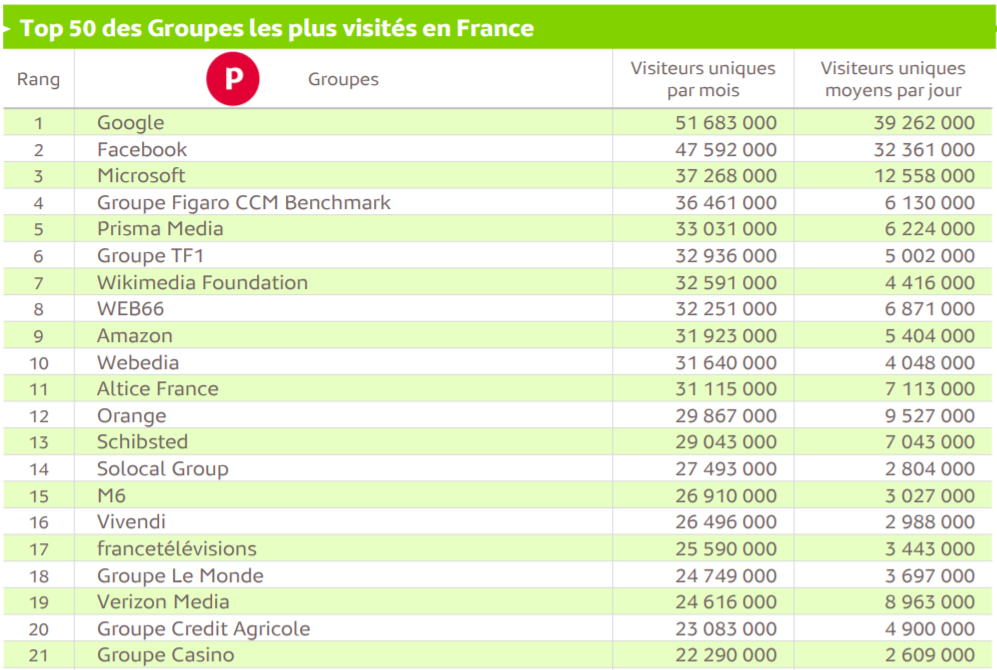
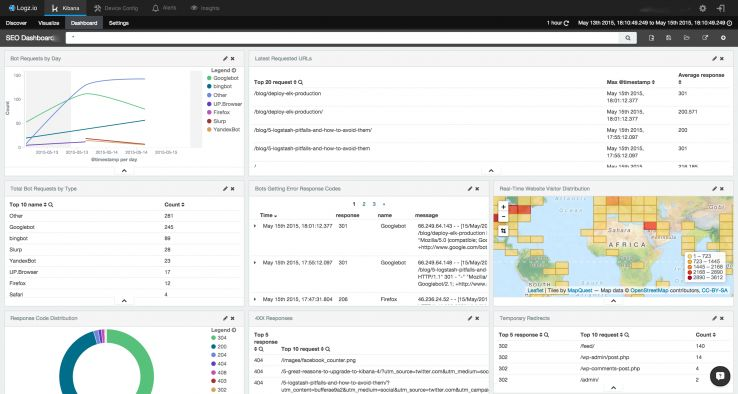

<!-- page_number: true -->
<!-- footer: Statistiques et mesure d'audience -->

Statistiques et mesure d'audience
===


##### De la mesure à l'aide à la décision

###### par [Fabien Barbaud](fabien.barbaud@timeonegroup.com) - [@BarbaudFabien](https://twitter.com/BarbaudFabien)

---

# Définition

## Audience (média)

L'audience d'un média définit l'ensemble des individus exposés, ou leur nombre ; elle fait l'objet de mesures : l'audimétrie [...] L'audimétrie relève de sondages. Il est parfois improprement fait référence à des audiences, au pluriel. Cet emploi concerne en fait, les résultats (de mesure) d'audience.

[Wikipédia](https://fr.wikipedia.org/wiki/Audience_(m%C3%A9dia))

---

# La méthode du sondage

## Le panel Médiamétrie

Médiamétrie, créée en 1985, est une société anonyme spécialisée dans la mesure d'audience et l'étude des usages des médias audiovisuels et numériques en France.

[Wikipedia](https://fr.wikipedia.org/wiki/M%C3%A9diam%C3%A9trie)

---

# La méthode du sondage

## Le panel Médiamétrie

### Télévision

- Panel de 5000 foyers (~11 400 personnes de +4ans)
- Méthode des quotas : extrapolation sur la population française
- Boitier qui permet d'identifier qui est devant la TV (même les invités)
- Gestion des enregistrements, replay et multi-écrans

---

# Médiamétrie - Résumé

## Les audiences télé, comment ça marche ? PDM#12


https://youtu.be/O7U_1xKwKIo

---

# La méthode du sondage

## Le panel Médiamétrie

### La radio

- Interview régulière sur une année de 126 000 personnes (+13 ans)
- Méthode des quotas
- Enquêtes complémentaires sur les comportements des auditeurs

---

# Médiamétrie - Résumé

## Les audiences radio, comment ça marche ? PDM#13


https://youtu.be/pk9Dremnupw

---

# La méthode du sondage

## Le panel Médiamétrie

### Internet

- Panel de 30 000 individus (+2 ans)
- 6 000 sites et 700 applications analysés
- Multi-devices : ordinateur, smartphone, tablette
- Enquêtes complémentaires sur les comportements des internautes

---

# Médiamétrie - Résumé

## Audience Internet Global en France en mai



https://www.mediametrie.fr/sites/default/files/2019-06/2019%2006%2028%20CP%20Audience%20Internet%20Global%20Mai%202019.pdf

---

# Audience d'un site Web - *Web analytics*

## Définition

L'Audience d'un site web est l'ensemble des personnes qui visitent ce site web. Sur internet, il existe plusieurs indicateurs permettant de mesurer l'audience d'un site web, tels que le nombre de visiteurs uniques, le nombre de pages vues, le nombre de visites, la durée moyenne des visites etc. La mesure, la collecte et l'analyse de données provenant d'Internet (ce qu'on appelle en anglais Web analytics) permettent de comprendre et d’optimiser les usages du web.

[Wikipedia](https://fr.wikipedia.org/wiki/Audience_d%27un_site_Web)

---

# Audience d'un site Web - *Web analytics*

## La mesure centrée-site - *site-centric*

- par l'analyse de logs
- taggage/marquage des pages 

---

# Audience d'un site Web - *Web analytics*

## La mesure centrée-site - *site-centric*

### Analyse de logs

Un journal (en anglais *log file* ou plus simplement *log*), est un fichier texte regroupant l’ensemble des événements survenus sur un serveur web incluant les requêtes et les réponses. Les journaux sont des fichiers générés par les serveurs web à chacune de leurs transactions. On peut en modifier le format pour les rendre plus compatibles avec les différents outils d'analyse.

[Wikipedia](https://fr.wikipedia.org/wiki/Audience_d%27un_site_Web#L'analyse_des_journaux_ou_%C2%AB_log_files_%C2%BB)

---

# Audience d'un site Web - *Web analytics*

## La mesure centrée-site - *site-centric*

### Analyse de logs

Copiez le projet : https://github.com/fabienbarbaud/stat-et-mesure-audience 
```bash
$ cd exemples
$ docker-compose up
```

http://localhost:8080/

---

# Audience d'un site Web - *Web analytics*

## La mesure centrée-site - *site-centric*

### Analyse de logs - NGINX

```
172.24.0.1 - - [20/Aug/2019:14:59:30 +0000] 
"GET /assets/css/font-awesome.min.css HTTP/1.1" 
200 
29063 
"http://localhost:8080/" 
"Mozilla/5.0 (Windows NT 10.0; Win64; x64) AppleWebKit/537.36
(KHTML, like Gecko) Chrome/76.0.3809.100 Safari/537.36" "-"
```

---

# Audience d'un site Web - *Web analytics*

## La mesure centrée-site - *site-centric*

### Analyse de logs - NGINX

```
$remote_addr - $remote_user - [$time_local]
"$request" 
$status 
$body_bytes_sent
"$http_referer" "$http_user_agent"
```

---

# Audience d'un site Web - *Web analytics*

## La mesure centrée-site - *site-centric*

### Analyse de logs - NGINX

#### $remote_addr
client address

#### $remote_user
user name supplied with the Basic authentication

#### $time_local
local time in the Common Log Format

---

# Audience d'un site Web - *Web analytics*

## La mesure centrée-site - *site-centric*

### Analyse de logs - NGINX

#### $request
full original request line

#### $status
response status

#### $body_bytes_sent
number of bytes sent to a client, not counting the response header

---

# Audience d'un site Web - *Web analytics*

## La mesure centrée-site - *site-centric*

### Analyse de logs - NGINX

#### $http_referer
HTTP Referer contient l'adresse de la page visitée précédente sur laquelle un lien a été suivi

#### $http_user_agent
une chaîne de caractères envoyée au serveur pour identifier l'agent utilisateur.

---

# Audience d'un site Web - *Web analytics*

## La mesure centrée-site - *site-centric*

### User Agent

```
Mozilla/5.0 (Windows NT 10.0; Win64; x64) AppleWebKit/537.36
(KHTML, like Gecko) Chrome/76.0.3809.100 Safari/537.36
```
**=> Chrome 76 on Windows 10**

---

# Audience d'un site Web - *Web analytics*

## La mesure centrée-site - *site-centric*

### Outils d'analyse de logs

#### AWStats

AWStats is a free powerful and featureful tool that generates advanced web, streaming, ftp or mail server statistics, graphically. This log analyzer works as a CGI or from command line and shows you all possible information your log contains, in few graphical web pages.

http://www.awstats.org/

---

# Audience d'un site Web - *Web analytics*

## La mesure centrée-site - *site-centric*

### Outils d'analyse de logs

#### NGINX, Elasticsearch and Kibana



https://logz.io/blog/nginx-log-analysis/

---

# Audience d'un site Web - *Web analytics*

## La mesure centrée-site - *site-centric*

### Taggage/marquage des pages 

les technologies de marqueurs, appelés en anglais tags (on parle aussi de web beacons (en) ou de web bugs (en) qu'on peut traduire par mouchards) permettent aussi une analyse du trafic. Les marqueurs ou tags sont généralement des appels d'images invoqués par JavaScript dans le code de la page web. Ils doivent donc être soigneusement ajoutés dans chaque page à analyser.

[Wikipedia](https://fr.wikipedia.org/wiki/Audience_d%27un_site_Web#La_mesure_de_fr%C3%A9quentation_par_marqueurs_Tag)

---

# Audience d'un site Web - *Web analytics*

## La mesure centrée-site - *site-centric*

### Taggage/marquage des pages 

#### Technologies

- Image
- Javascript
- Appel API
- Back

---

# Audience d'un site Web - *Web analytics*

## La mesure centrée-site - *site-centric*

### Taggage/marquage des pages 

#### Image

```html

```

---

# Audience d'un site Web - *Web analytics*

## La mesure centrée-site - *site-centric*

### Taggage/marquage des pages 

#### Javascript

```html
<!-- Matomo Tag Manager -->
<script type="text/javascript">
    var _mtm = _mtm || [];
    _mtm.push({'mtm.startTime': (new Date().getTime()), 'event': 'mtm.Start'});
    var d=document, g=d.createElement('script'), s=d.getElementsByTagName('script')[0];
    g.type='text/javascript'; g.async=true; g.defer=true; g.src='https://{$MATOMO_URL}/js/container_{$CONTAINER}.js'; s.parentNode.insertBefore(g,s);
</script>
<!-- End Matomo Tag Manager -->
```

---

# Audience d'un site Web - *Web analytics*

## La mesure centrée-site - *site-centric*

### Taggage/marquage des pages 

#### API

```
http://piwik-server/piwik.php?_cvar={"1":["OS","iphone 5.0"],
"2":["Matomo Mobile Version","1.6.2"],"3":["Locale","en::en"],
"4":["Num Accounts","2"]}&action_name=Viewsettings
&url=http://mobileapp.piwik.org/window/settings
&idsite=8876&rand=351459&h=18&m=13&s=3&rec=1&apiv=1&cookie=1
&urlref=http://iphone.mobileapp.piwik.org
&_id=af344a398df83874 &_idvc=19&res=320×480&
```

---

# Audience d'un site Web - *Web analytics*

## La mesure centrée-site - *site-centric*

### Taggage/marquage des pages

#### Matomo

Matomo, anciennement Piwik jusqu’au début de 2018, est un logiciel libre et open source de mesure de statistiques web, successeur de PhpMyVisites et conçu pour être une alternative libre à Google Analytics. Matomo fonctionne sur des serveurs web PHP/MySQL. En juillet 2017, Matomo était utilisé par plus d'un million de sites web5 et crédité de 1,3 % de parts de marché. Matomo est aujourd'hui traduit dans 54 langues et est régulièrement mis à jour par sa communauté.

[Wikipedia](https://fr.wikipedia.org/wiki/Matomo_(logiciel))

---

# Audience d'un site Web - *Web analytics*

## La mesure centrée-site - *site-centric*

### Taggage/marquage des pages

#### Google Analytics

Google Analytics est un service gratuit d'analyse d'audience d'un site Web ou d'applications utilisé par plus de 10 millions de sites, soit plus de 80 % du marché mondial.

[Wikipedia](https://fr.wikipedia.org/wiki/Google_Analytics)

---

# Audience d'un site Web - *Web analytics*

## La mesure centrée-site - *site-centric*

### Capacités des outils

- Collecte de données
- Analyse et aggrégation des informations
- Reconstruction des parcours client
- Classification des profils
- Suivi des campagnes publicitaires
- Evaluation des résultats d'action marketing (interne ou externe)
- ...

---

# Audience d'un site Web - *Web analytics*

## La mesure centrée-site - *site-centric*

### Quelques mots de vocabulaire avant de commencer

- tunnel/funnel
- conversion
- landing page
- source
- session
- SEM

---

# Audience d'un site Web - *Web analytics*

## La mesure centrée-site - *site-centric*

### Et quelques indicateurs

- taux de transformation (*conversion rate*)
- taux de clic (*click rate*)
- taux de rebond (*bounce rate*)
- coût d'acquisition client (CAC)
- temps moyen de session (*average session duration*)

---

# Audience d'un site Web - *Web analytics*

## La mesure centrée-site - *site-centric*

### Exercice pratique 

Etablir une comparaison des outils Matomo et Google Analytics sur les aspects suivants :
- Collecte de données
- Dashboard et diversités des outils de visualisation
- Fonctionnalités accès e-commerce
- SEM
- Facteurs différenciants

---

# La mesure d'audience dans une campagne de communication digitale


---

# La mesure d'audience dans une campagne de communication digitale

## Les différentes sources de trafic

- Direct
- Liens sur sites référents
- Réseaux sociaux
- Moteurs de recherche
- Mail
- Affiliation
- Display

---

# La mesure d'audience dans une campagne de communication digitale

## Les différentes sources de trafic

### Direct

Elle est définie par les visiteurs qui viennent **directement sur le site**, en entrant par exemple manuellement l'URL du site web ou en venant directement depuis les favoris.

**Attention :** les visteurs dont on ne connait pas ou que l'on ne peut déterminer la provenance, sont généralement comptabilisés dans cette catégorie.

---

# La mesure d'audience dans une campagne de communication digitale

## Les différentes sources de trafic

### Liens sur sites référents

Elle est utilisée pour décrire les visiteurs du site qui proviennent de **liens depuis d'autres sites** autres que les sources de trafic comme les moteurs de recherche ou les réseaux sociaux.

Ces liens sont la base de la construction du Web. Ils proviennent souvent de partenariats ou plus simplement de citations dans la cadre d'articles (blog, journaux, ...) ou de références.

---

# La mesure d'audience dans une campagne de communication digitale

## Les différentes sources de trafic

### Réseaux sociaux

Ce trafic est comptabilisé à partir des différents liens disponibles sur les réseaux sociaux comme Facebook, Twitter, Linkedin, ...

Il est généralement issu d'une stratégie de communication qui permet une présence forte sur les réseaux. La multpilication des interactions, Like, contenus postés, ... permet d'augmenter la trafic provenant de cette source.

---

# La mesure d'audience dans une campagne de communication digitale

## Les différentes sources de trafic

### Moteurs de recherche

Cette source regroupe l'ensemble des liens disponibles vers le site sur les différents moteurs de recherche.

Ce trafic peut provenir aussi bien d'un référencement naturel, optimiser son site pour mettre en avant le ou les contenus recherchés par les internautes, ou du référencement payant, par de l'achat de résultats sur un ou plusieurs mots clé.

---

# La mesure d'audience dans une campagne de communication digitale

## Les différentes sources de trafic

### Mail

Le trafic provenant d'un lien se trouvant dans un mail envoyé à un internaute est comptabilisé sur cette source.

Il peut s'agir :

- marketing relationnel : email envoyé durant toute la relation avec le client
- campagnes marketing : diffusion d'une offre sur un volume important de contact
- marketing transactionnel : email envoyé dans le but de finaliser la conversion

---

# La mesure d'audience dans une campagne de communication digitale

## Les différentes sources de trafic

### Affiliation

L'affiliation sur Internet est une technique e-marketing permettant à un site web annonceur de promouvoir ses produits ou ses services en proposant une rémunération à d'autres sites web éditeurs (affiliés) en échange d'un apport de ventes, d'inscriptions ou de trafic.

[Wikipedia](https://fr.wikipedia.org/wiki/Affiliation_(internet))

---

# La mesure d'audience dans une campagne de communication digitale

## Les différentes sources de trafic

### Display

Trafic provenant exclusivement de campagnes marketing qui concernent la diffusion de publicité "visuelle" sous différents formats : bannières de publicité, habillage de site, interstitiel, popup, ...

Ces campagnes sont généralement facturées au CPM ou CPC.


